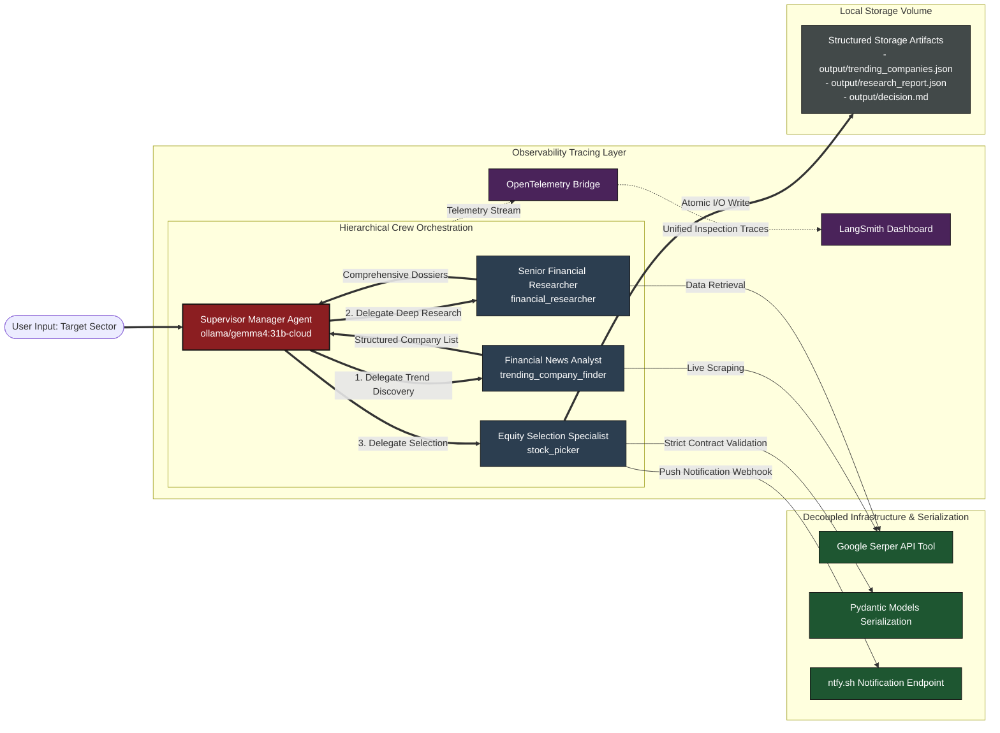

# Market Compass: Hierarchical Multi-Agent Investment Orchestrator

[](https://crewai.com)
[](https://smith.langchain.com)
[](https://github.com/astral-sh/uv)
[](https://www.docker.com)

Market Compass is an enterprise-grade, production-ready multi-agent system designed to automate quantitative financial news analysis, deep industry research, and autonomous equity selection. Powered by the CrewAI framework and orchestrated through a **Hierarchical Process**, the system leverages a dedicated manager agent to supervise specialized analyst nodes, enforce strict structured data serialization via Pydantic, and dispatch real-time trade signals via custom decoupled webhooks.

Engineered with a systems-first mindset, this project transcends basic scripting tutorials by implementing native OpenTelemetry (OTel) observability tracing into LangSmith, mitigating multi-platform cross-runtime timezone defects, and optimizing dependency management via ultra-fast environments.

---

## 🚀 Key Real-World Applications

* **Automated Sector Screening & Trend Analysis**: Dynamically monitors high-growth or highly volatile market sectors (e.g., Banking, FinTech, Energy) to track shifting macro trends and surface emerging players.
* **Autonomous Market Intelligence Extraction**: Continuously crawls live news endpoints, aggregates data streams, and synthesizes institutional-grade qualitative research dossiers on active market movers.
* **Real-Time Signal Generation & Dissemination**: Filters and scores multiple evaluated financial entities down to a singular optimal investment asset, immediately dispatching actionable trade notifications via live push webhooks.

---

## 🏗️ System Architecture & Design

The framework is split into highly siloed, decoupled execution roles managed by a centralized supervisor engine to guarantee strict containment and operational focus.

### 1. Agentic Roles & Collaboration Layout

* **Supervisor Manager Agent (`ollama/gemma4:31b-cloud`)**: Functions as the central infrastructure controller. It evaluates global operational state, distributes context inputs, delegates tactical tasks to execution nodes, and reviews completed work artifacts before terminal exit.
* **Financial News Analyst (`trending_company_finder`)**: Screens live regional text updates and isolates 2–3 high-interest companies gaining substantial media momentum within the chosen sector.
* **Senior Financial Researcher (`financial_researcher`)**: Inherits the targeted company list from the supervisor and conducts deep online data retrieval to generate comprehensive financial reports.
* **Equity Selection Specialist (`stock_picker`)**: Performs comparative qualitative analysis on the research data, selects the premium asset for investment, compiles the final markdown disclosure, and triggers external alert pipelines.

### 2. Structured Data Flow & Serialization

To secure absolute operational reliability across agent boundaries, data is strictly structured and validated using Pydantic models. Framework boundaries enforce schemas such as `TrendingCompanyList` and `TrendingCompanyResearchList` to eliminate parsing degradation or missing structural attributes during handoffs.

### 3. Architecture Flowchart



# 🛠️ Systems Engineering Challenges & Resolutions

As a project designed by an engineer with a deep background in TechOps, Middleware, and Infrastructure Stability, this codebase explicitly surfaces and addresses production runtime challenges that standard tutorials overlook:

### 1. Telemetry Blindspots in Distributed Agent Frameworks
* **The Challenge:** Multi-agent frameworks like CrewAI execute complex, nested inner loops (agent thoughts, tool calls, delegation steps) that are completely invisible via standard environment telemetry logs. This leaves infrastructure teams blind to runtime failures and unexpected token drain.
* **The Resolution:** Configured an OpenTelemetry (OTel) Bridge inside `crew.py`. By wrapping runtime executions with an `OtelSpanProcessor` and initializing the `CrewAIInstrumentor`, every single token exchange, inner monologue, and sub-second tool execution hook is explicitly streamed into an external LangSmith Dashboard for unified monitoring and auditability.

### 2. Temporal Cloud Drift & Hallucination
* **The Challenge:** Cloud runtimes (such as Hugging Face Spaces containers) run on strict UTC system clocks, causing the agent to hallucinate dates or fail time-sensitive web lookups when evaluating live financial data. Furthermore, local Windows dev environments often lack native IANA geographic zone directories, triggering a fatal `ZoneInfoNotFoundError` fallback.
* **The Resolution:** Engineered a context-aware temporal localization framework using Python’s built-in `zoneinfo` module. To ensure structural cross-runtime compatibility, the official IANA database package (`tzdata`) was explicitly added directly into the managed runtime environment via `uv`. This allows the multi-agent system to mathematically calculate accurate, localized date thresholds before triggering live downstream search tools.

### 3. Container Isolation & Output Exfiltration
* **The Challenge:** Standard container boundaries hide filesystem changes from the final user. Any markdown file generated locally inside the workspace is lost once execution completes or the session resets.
* **The Resolution:** Built a custom, asynchronous, decoupled notification connector (`PushNotificationTool`) extended directly over `crewai.tools.BaseTool`. The tool serializes the outcome and dispatches an actionable live push notification payload directly to an external `ntfy.sh` server topology, keeping data consumption zero-cost and real-time without relying on fragile mail servers or paid object stores.

---

# ⚙️ Installation & Setup

### Prerequisites
Ensure you have `uv` (the ultra-fast Python package and environment manager) installed on your system.

```bash
# Install uv if you haven't already
curl -LsSf [https://astral.sh/uv/install.sh](https://astral.sh/uv/install.sh) | sh
```

### 1. Clone & Synchronize Environment
Clone the project repository, navigate into the directory, and compile project dependencies automatically into an isolated virtual environment:

```bash
git clone [https://github.com/your-username/Market-Compass.git](https://github.com/your-username/Market-Compass.git)
cd Market-Compass
uv sync
uv add tzdata
```

### 2. Configure Environment Variables
Create a `.env` file in the root directory of the project and populate your infrastructure and API credentials:

```env
# LLM & Infrastructure Credentials
OPENAI_API_BASE="your-ollama-cloud-or-local-endpoint"
OPENAI_API_KEY="your-llm-access-token"

# Search Infrastructure
SERPER_API_KEY="your-serper-dev-search-key"

# Real-time Webhook Dissemination
NTFY_URL="[https://ntfy.sh/your_custom_secure_topic_id](https://ntfy.sh/your_custom_secure_topic_id)"

# LangSmith OpenTelemetry Observability
LANGCHAIN_TRACING_V2="true"
LANGCHAIN_PROJECT="Market-Compass-Orchestration"
LANGCHAIN_API_KEY="your-langsmith-api-key"
```


### 3. Execute the Orchestration Loop
Run the multi-agent framework directly from your terminal:

```bash
uv run run_crew
```


The application will dynamically calculate your localized runtime stamp, feed target parameters to the supervisor, and write structured output artifacts directly to disk (`output/trending_companies.json`, `output/research_report.json`, and `output/decision.md`) while firing a mobile alert via your custom push notification web endpoint.

---

### 🚧 Roadmap & Work in Progress
* [ ] **Reactive Presentation Interface (Gradio Web UI):** Developing a reactive web frontend to decouple configuration parameters from terminal execution loops, allowing users to input market sectors dynamically and inspect nested token traces side-by-side.
* [ ] **Production Containerization & Cloud Hosting:** Engineering a multi-stage `Dockerfile` to deploy the backend onto Hugging Face Spaces, configuring specific YAML metadata repo headers to automate cloud-build infrastructure hooks.
* [ ] **Distributed Cloud Persistence Memory Layers:** Migrating the stateful execution footprint from local caching layers to external cloud databases (such as a detached MongoDB Atlas cluster or persistent Neon PostgreSQL), incorporating automated Time-To-Live (TTL) data-retention scripts to safely manage session history bounds.